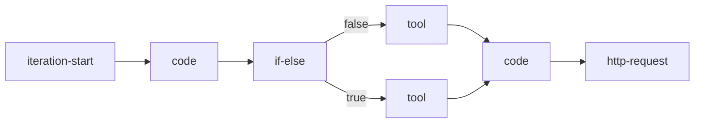

# 节点依赖关系分析

## 节点类型概览

从配置文件中可以看到以下节点类型：
1. `start` - 工作流起点
2. `code` - 代码执行节点
3. `http-request` - HTTP请求节点
4. `tool` - 工具节点
5. `if-else` - 条件分支节点
6. `iteration` - 迭代节点
7. `iteration-start` - 迭代开始节点
8. `end` - 工作流终点

## 节点间连接特征

### 连接属性
1. `isInIteration` - 标识节点是否在迭代中
2. `iteration_id` - 迭代上下文标识
3. `sourceType` - 源节点类型
4. `targetType` - 目标节点类型
5. `zIndex` - 连接线层级

### 特殊连接类型
1. 迭代内连接 (`isInIteration: true`)
   - 具有特定的 `iteration_id`
   - `zIndex` 通常为 1002

2. 主流程连接 (`isInIteration: false`)
   - 无 `iteration_id`
   - `zIndex` 通常为 0

## 数据流向分析

### 主流程

### 迭代流程

## 关键发现

1. 多层次结构
   - 主流程和迭代流程清晰分离
   - 使用 `zIndex` 控制连接线层级
   - 迭代内支持复杂的分支逻辑

2. 条件分支处理
   - 使用 `if-else` 节点进行流程分支
   - 分支可以连接到不同类型的节点
   - 支持 true/false 两个分支路径

3. 工具节点使用
   - 多个工具节点可以汇聚到同一个代码节点
   - 工具节点主要出现在迭代流程中
   - 工具节点通常与条件分支配合使用

## 下一步分析建议

1. 深入分析每种节点的具体配置
2. 研究迭代上下文的数据传递
3. 分析条件分支的判断逻辑
4. 研究工具节点的具体功能

## 注意事项

1. 节点关系管理
   - 注意维护正确的 `iteration_id`
   - 确保 `sourceType` 和 `targetType` 匹配
   - 合理设置 `zIndex` 避免连接线混乱

2. 迭代流程设计
   - 注意迭代内的数据隔离
   - 确保迭代终止条件明确
   - 处理好迭代异常情况

3. 条件分支设计
   - 确保所有分支路径都有效
   - 避免死循环
   - 处理好分支合并点的数据聚合 